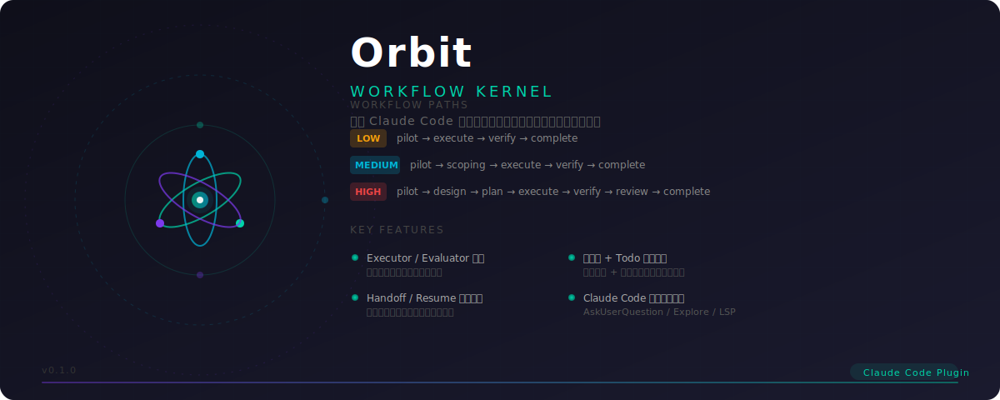

# Orbit

<p align="center">
  
</p>

面向 Claude Code 的通用工作流插件。

`Orbit` 不是一堆零散命令，而是为 Claude Code 提供一套**可重复、可恢复、可评估、可分层**的任务执行内核——让模型在复杂软件工程任务里更稳定地规划、实现、验证、交接。

## 核心理念

### 1. Evaluator 与 Executor 分离

复杂任务默认不允许执行者自己给自己判定"完成得很好"。

- `executor` 负责产出实现
- `evaluator` 负责独立判断完成度、质量与是否达标
- 评估失败时仍由**首次执行者**继续修复

执行者最了解当前改动上下文，evaluator 负责客观闸门，二者职责分离能减少"重新交接给陌生修复者"带来的上下文损耗。

### 2. Handoff 与恢复载荷是一等公民

任务进入阶段边界、子代理执行中断时必须有 handoff。

- `handoff`：Orbit 产出的结构化恢复载荷，用于子代理或任务级执行在异常中断后继续
- 官方恢复命令：主会话恢复仍交给 Claude Code 官方机制；Orbit 不注册任何 Claude Code skill，避免命名冲突

`handoff` 不是冗长会议纪要，而是子代理恢复任务真正需要的最小信息：当前焦点、当前状态、下一步唯一动作、已确认的关键决策、风险与待验证项。

原则：**恢复优先于重来；聚焦优先于堆上下文；最小高价值上下文优先于全量记录**。

### 3. 按思考密度分层

任务复杂度首先取决于**是否需要设计性思考**，而不是改几个文件。

#### Low

不需要设计，只是实现已知改动。

例：调整样式、修改 API 返回结构、补一个明确的小逻辑分支。

#### Medium

需要思考和设计，但单轮内可以收敛边界。

例：模块内的新增功能、单模块重构、需要先理解现有系统能力再实现的任务。

#### High

需求模糊、目标较大、背景不足，需要多轮澄清、方案比较，并且通常可以拆成多个 medium 任务。

例：大范围新能力设计、缺乏上下文支撑的架构性任务、需要先做多轮 design exploration 才能进入实现的任务。

### 4. 状态机保障任务流转

Orbit 的任务执行不是"看感觉推进"，而是由状态机约束：

- 当前在哪个阶段
- 下一步允许做什么
- 什么条件下可以进入下一个阶段
- 失败后如何回退
- 暂停后如何恢复

状态机只解决"阶段"，不解决"当前回合先做什么"。Orbit 因此采用轻量双层模型：

- **状态机**：维护任务阶段
- **`todo` + `next_action`**：维护当前会话执行动作

最小可执行内核包括：

- 运行时状态 schema：`plugins/orbit/state/runtime-state.schema.json`
- 规则源：`plugins/orbit/state/rules.json`
- 统一工件槽位：`triage / scope / design / plan / execution / verification / review / handoff / task_packet`
- 通过唯一 `/orbit:pilot` 入口、提示词与阶段规则推进

核心硬规则：

- `density` 决定可进入阶段
- `VERIFY_FAIL` / `REVIEW_FAIL` 只能回到 `repairing`
- `repairing.current_owner` 必须等于 `first_executor`
- `paused` 与 handoff payload 必须携带 `next_action`
- 任意时刻只能有一个 `todo` 处于 `in_progress`
- `DESIGN_DONE` 前 `design.md` 必须含 `## User Approval` 锚点且 `approved_option` 非空
- `VERIFY_PASS` / `REVIEW_PASS` 前对应工件 md 必须含独立 evaluator 锚点且 `result=PASS`
- 连续 verify FAIL 达到 `consecutive_verify_fail_limit`（默认 3）必须停止循环，用 AskUserQuestion 让用户决定升级 / 重设方案 / 取消

## 工作流形态

### Low

```text
triaged -> executing -> verifying -> completed
```

适用于已知改动；进入最小验证，`verification_level=optional` 表示验证强度可轻量，但仍由独立 evaluator 给出结论。

### Medium

```text
triaged -> scoping -> executing -> verifying -> completed
```

先收敛边界，再实现，再 required 验证。

### High

```text
triaged -> designing -> planning -> executing -> verifying -> reviewing -> completed
```

先澄清需求和方案，再生成计划，再执行、验证、双阶段审查，最后完成。

## 仓库结构

```text
Orbit/
├─ README.md
└─ plugins/
   └─ orbit/
      ├─ .claude-plugin/plugin.json
      ├─ commands/
      │  └─ pilot.md
      ├─ references/
      │  ├─ brainstormer.md
      │  ├─ state-protocol.md
      │  └─ native-tools.md
      ├─ agents/
      └─ state/
```

- `plugins/orbit/.claude-plugin/plugin.json`：插件清单
- `commands/pilot.md`：显式 `/orbit:pilot` 工作流入口，禁用模型自动调用
- `references/`：跨阶段共享的状态协议、原生工具指南与主会话内联执行的 brainstormer 流程
- `/orbit:pilot` 内部阶段：scoping / design / planning / execute / verify / reviewing / handoff，不暴露为 Claude Code skill
- `agents/`：单次执行角色（executor / evaluator / spec-compliance-evaluator / code-quality-evaluator）
- `state/`：状态 schema 与 examples

## 当前已落地的运行时能力

### 1. 评估者客观评价，首次执行者负责修复

- `evaluator` 只负责 PASS / FAIL 与 repair direction
- FAIL 必须进入 `repairing`
- `repairing` 的执行者必须是 `first_executor`

### 2. 阶段性 handoff / 恢复

- `handoff` 产出结构化恢复载荷
- 后续会话按工件优先级恢复上下文，优先读取 `handoff.json`
- `next_action` 是恢复的强制字段

### 3. low / medium / high 差异化工作流

- `low`：最短闭环
- `medium`：增加 scoping
- `high`：增加 designing / planning / reviewing

### 4. 状态机 + Todo 双层约束

- 状态机约束阶段与事件
- `todo` 约束当前动作序列
- 通过提示词约定、状态协议与人工抽查维持合法状态

## 一句话总结

Orbit 是一个让 Claude Code 围绕任务稳定运转的可扩展工作流内核。
